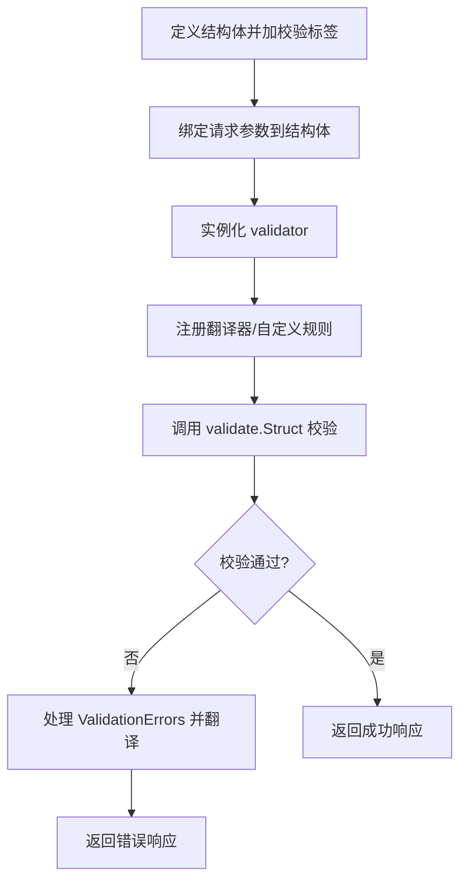

```
package main

import (
	"fmt"
	"github.com/go-playground/validator/v10"
)

// 定义需要验证的结构体
type User struct {
	Name     string `validate:"required,min=2,max=10"` // 非空，长度2-10
	Age      int    `validate:"gte=0,lte=150"`         // 大于等于0，小于等于150
	Email    string `validate:"required,email"`        // 非空，符合邮箱格式
	Phone    string `validate:"omitempty,len=11"`      // 可选，若存在则长度必须为11
	Password string `validate:"required,min=6"`        // 非空，最小长度6
}

func main() {
	// 创建验证器实例
	validate := validator.New()

	// 待验证的用户数据
	user := User{
		Name:     "a",       // 长度不足（违反 min=2）
		Age:      200,       // 年龄超出范围（违反 lte=150）
		Email:    "invalid", // 邮箱格式错误
		Phone:    "12345",   // 长度不足（违反 len=11）
		Password: "123",     // 长度不足（违反 min=6）
	}

	// 执行验证
	err := validate.Struct(user)
	if err != nil {
		// 处理验证错误
		if _, ok := err.(*validator.InvalidValidationError); ok {
			fmt.Println("验证器初始化错误:", err)
			return
		}

		// 遍历所有验证错误
		for _, err := range err.(validator.ValidationErrors) {
			fmt.Printf("字段 %s 验证失败: %s (规则: %s)\n",
				err.Field(),   // 错误字段名
				err.Value(),   // 错误字段的值
				err.Tag())     // 违反的验证规则
		}
		return
	}

	fmt.Println("所有字段验证通过！")
}

```