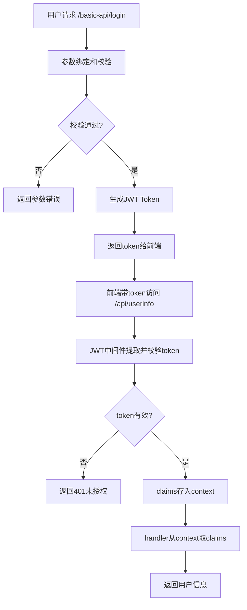

# 完整用户登录和用户验证流程

1. 用户登录（@api_user.go）

- 用户通过 /basic-api/login 接口提交用户名和密码。
- handler Login：
  1. 用 ShouldBind 绑定请求体到 UserLoginRequest 结构体。
  2. 用 validate.Struct 校验参数（支持多语言错误提示）。
  3. 校验通过后，构造 dbUser（模拟数据库用户）。
  4. 调用 models.SignToken(dbUser, &config.Gcfg) 生成JWT token。
  5. 返回 token 给前端，响应结构体中包含 token、用户信息等。

2. 生成JWT Token（@request_jwt.go）

- SignToken 函数：
  1. 构造自定义 claims（UserCustomClaims），包含用户信息和标准JWT字段（如Issuer、ExpiresAt）。
  2. 用 jwt.NewWithClaims 生成 token 对象。
  3. 用密钥 myJwt.SigningKey 签名，得到最终的 Header.Payload.Signature 格式的token字符串。
  4. 返回 token。

3. 路由注册（@route.go）
   /basic-api/login、/basic-api/ping 是公开接口。
   /api/userinfo 需要登录认证，挂载了 middleware.JWTAuth()。
4. 用户认证（@jwt.go）

- JWTAuth 中间件：
  1. 从请求头 Authorization 获取 token，自动去除 Bearer 前缀和空格。
  2. 调用 ParseToken(token) 校验并解析token。
  3. 校验通过后，将 claims 存入 Gin context（c.Set(common.GIN_CTX_JWT_CLAIM, claims)）。
  4. 校验失败则返回401错误，终止请求。
- ParseToken：
  1. 用密钥和自定义 claims 结构体解析token。
  2. 校验签名、过期时间等，解析出 claims。
  3. 校验失败返回对应错误。

5. 登录后获取用户信息（@api_user.go）

- /api/userinfo handler GetUserInfoAfterInfo：
  1. 从 Gin context 取出 claims（c.MustGet(common.GIN_CTX_JWT_CLAIM)）。
  2. 取出 claims.User，返回用户信息。

# 总结流程：

1. 用户登录 → 校验参数 → 生成token → 返回token
2. 前端带token访问受保护接口
3. JWT中间件校验token → 解析claims → 存入context
4. handler从context取claims，获取用户信息

# 核心点：

1. 登录时生成JWT，返回给前端
2. 受保护接口用JWT中间件校验token
3. 业务handler从context获取claims，拿到用户信息

流程图：

