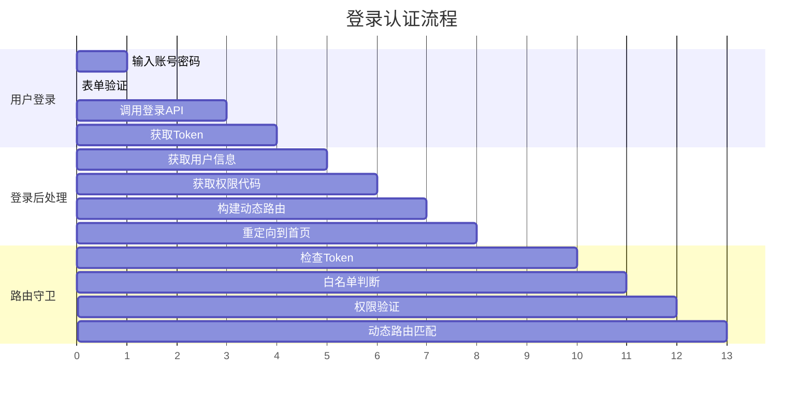

```mermaid
gantt
    title 登录认证流程
    dateFormat X
    axisFormat %s
    
    section 用户登录
    输入账号密码 :0, 1
    表单验证 :1, 
    调用登录API :2, 3
    获取Token :3, 4
    
    section 登录后处理
    获取用户信息 :4, 5
    获取权限代码 :5, 6
    构建动态路由 :6, 7
    重定向到首页 :7, 8
    
    section 路由守卫
    检查Token :9, 10
    白名单判断 :10, 11
    权限验证 :11, 12
    动态路由匹配 :12, 13
```
