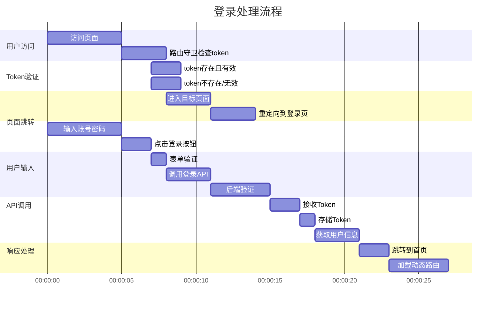

```mermaid
gantt
    title 用户访问认证流程
    dateFormat  HH:mm:ss
    axisFormat %H:%M:%S

    section 用户访问
    访问页面           :a1, 00:00:00, 5s
    路由守卫检查token   :a2, after a1, 3s

    section Token验证
    token存在且有效    :b1, after a2, 2s
    token不存在/无效   :b2, after a2, 2s

    section 页面跳转
    进入目标页面       :c1, after b1, 3s
    重定向到登录页     :c2, after b2, 3s

    title 登录处理流程
    dateFormat  HH:mm:ss
    axisFormat %H:%M:%S

    section 用户输入
    输入账号密码       :a1, 00:00:00, 5s
    点击登录按钮       :a2, after a1, 2s

    section API调用
    表单验证           :b1, after a2, 1s
    调用登录API        :b2, after b1, 3s
    后端验证           :b3, after b2, 4s
    
    section 响应处理
    接收Token          :c1, after b3, 2s
    存储Token          :c2, after c1, 1s
    获取用户信息       :c3, after c2, 3s
    
    section 页面跳转
    跳转到首页         :d1, after c3, 2s
    加载动态路由       :d2, after d1, 4s
```